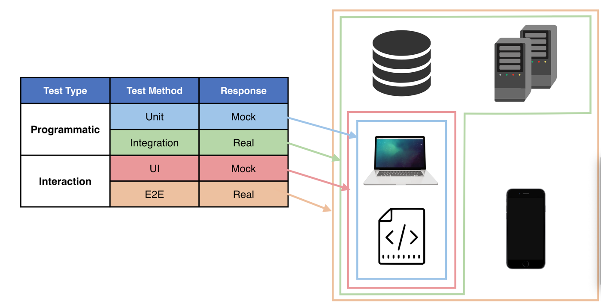

# Automated Tests

<div align="center">
  
</div>

## Programmatic

### Unit tests (Mock)

- Use mock data to test single units of code.

#### Jest

```sh
npm install ts-jest @types/jest
npx ts-jest config:init
```

### Integration tests

- Use real network response to test single units of code

## Interaction

### UI Tests

- Interprets the user journey

### E2E Tests

- Interprets the user journey with real network response
